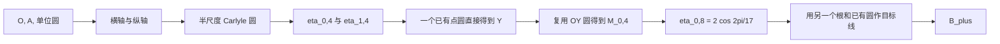

# DeTemple 1991 修改版 Carlyle 圆构造的 19 E 转写

## 结论与证据等级

本目录把 DeTemple 论文第 104 页明确给出的两项修改转写为
`regular-17-e-fixed-v1`，删除被半尺度路线完全取代的完整尺度根分支，用
局部精确圆捷径替换第一次距离搬运、以三线窗口定位最后的 Carlyle 圆心，并以
两步精确目标线替换最后一次搬运。
SageMath 10.7 reference verifier 从磁盘独立加载证书并精确重放为：

```text
直线：8
圆：11
总分：19 E
首次命中：第 19 E
目标：B_plus
重复绘制：0
```

因此 19 E 是同一 profile 下比原 32 E baseline 短 13 E 的新已验证上界。它不是
lower-bound proof，也不支持“全局最优”或“文献最短”声明。

## 来源与模型差异

- Duane W. DeTemple, “Carlyle Circles and the Lemoine Simplicity of Polygon
  Constructions,” *The American Mathematical Monthly* 98(2), 1991, 97–108；
  [JSTOR 稳定页](https://www.jstor.org/stable/2323939)。
- 十七边形主构造在第 102–104 页、图 3、步骤 (i)–(x)；两项修改位于第
  104 页；[可核对 PDF](https://sharingthesoul.wordpress.com/wp-content/uploads/2021/03/carlyle-and-lemoine-polygon-constructions-detemple1991.pdf)。

原文免费给出单位圆和坐标轴，使用 modern non-collapsing compass，并以
Lemoine simplicity 计分。本文为两条坐标轴计费，并把两次任意距离搬运展开成
可折叠圆规基础操作。因此原文修改版的 45 与这里的 19 E 不可直接比较。

## 两项修改为何成立

原路线的步骤 (ii)–(iii) 先用两个圆得到

\[
H_{0,2}=\eta_{0,2},\qquad H_{1,2}=\eta_{1,2},
\]

步骤 (iv) 再分别作 (OH_{0,2})、(OH_{1,2}) 的中点。两个完整尺度根只服务于
这次取半；步骤 (ii)–(iv) 合计需要 2 个前置圆、4 个二等分圆和 2 条中垂线，
即 8 E。

第一项修改把变量缩放为 (x=2m)。由

\[
x^2+x-4=0
\]

得到

\[
m^2+\frac12m-1=0.
\]

该方程的 Carlyle 圆圆心是 (Q''=(-1/4,0))，并经过 (A_y=(0,1))；
它与横轴的两个交点恰好是

\[
M_{0,2}=\frac{\eta_{0,2}}2,\qquad
M_{1,2}=\frac{\eta_{1,2}}2.
\]

先用 3 E 作 (Q'O) 的中垂线得到 (Q'')，再用 1 E 作这个半尺度
Carlyle 圆，总计 4 E。由于该圆已经直接给出步骤 (v) 所需的两个圆心，完整尺度
的 (H_{0,2})、(H_{1,2}) 不再有任何后继；因此步骤 (ii)–(iv) 的 8 E 分支可被
整体替换，净省 4 E。

第二项修改复用步骤 (vi) 已画出的圆：该圆以 (O) 为圆心并经过
(Y=(0,1+\eta_{1,4}))。只需再画以 (Y) 为圆心、经过 (O) 的圆，便可用
一条直线得到 (OY) 的中垂线。直线 (YH_{0,4}) 与这条中垂线的交点为

\[
M_{0,4}=\left(\frac{\eta_{0,4}}2,
\frac{1+\eta_{1,4}}2\right),
\]

正是最后一个 Carlyle 圆的圆心。该段由 4 E 降为 3 E，再省 1 E。

## 第一次距离搬运的局部精确捷径

原步骤 (vi) 用 5 E 把 (QH_{1,4}) 搬运到 (O)，以得到

\[
Y=(0,1+\eta_{1,4}).
\]

逐个枚举该阶段已有对象的精确交点后，可免费绑定

\[
D=(-1/2,1/2),
\]

它是 `bisector_QO` 与 `c_Qhalf_O` 的上交点。以 (D) 为圆心、经过
(H_{1,4}=(\eta_{1,4},0)) 的圆也经过 (Y)，因为

\[
DH_{1,4}^2=(\eta_{1,4}+1/2)^2+(1/2)^2
=DY^2.
\]

因此只需 1 E 即可直接得到 (Y)。

局部两步窗口继续给出三个免费绑定点：

\[
R=(1/2,0),\qquad
V=(-1/4,-1.030776\ldots),\qquad
N=(-1/2,\eta_{1,2}/2).
\]

其中 (R) 是 `x_axis` 与 `c_O_Qhalf` 的右交点，(V) 是 `bisector_Qhalf_O`
与半尺度 Carlyle 圆的下交点；直线 (M_{0,2}V) 与 `bisector_QO` 交于 (N)。
利用周期恒等式

\[
(\eta_{1,2}/2)(1-\eta_{0,4})=1+\eta_{1,4},
\]

可知直线 (NR) 与 (YH_{0,4}) 的交点恰好为

\[
M_{0,4}=\left(\eta_{0,4}/2,(1+\eta_{1,4})/2\right).
\]

所以直接圆、三条直线和最后的 Carlyle 圆合计 5 E，替换原组合段的 9 E。

## 最终两步目标线

最后一个 Carlyle 圆与横轴给出两个根

\[
H_{0,8}=2\cos(2\pi/17),\qquad H_{4,8}=0.184536\ldots.
\]

以 (O) 为圆心、经过 (H_{4,8}) 画圆。该圆与已有的 `c_Q_O` 相交于上下两点；
取上交点 (P)，则 AA 精确重建确认直线 (QP) 经过

\[
B_+=(\cos(2\pi/17),\sin(2\pi/17)).
\]

因此该线与初始单位圆直接给出 (B_+)。末段只需 1 个圆和 1 条直线，由原转写的
6 E 降为 2 E。选择下交点可得到镜像路线，但 profile 只要求任一相邻顶点，证书
不为第二条线额外计费。

## 计分

| 分组 | 直线 | 圆 | E |
|---|---:|---:|---:|
| 构造横轴、纵轴 | 2 | 2 | 4 |
| 步骤 (i)–(v)，含半尺度修改与分支清理 | 2 | 6 | 8 |
| 直接得到 Y、三线定位圆心并完成步骤 (ix) | 3 | 2 | 5 |
| 最终两步目标线 | 1 | 1 | 2 |
| 合计 | 8 | 11 | 19 |

两次距离搬运均已被精确几何替换。交点绑定为 0 E，但所有用于画线、画圆的点
都可追溯到两个已构造对象的确定性交点。

## 依赖主链



完整的逐条目直接依赖、每个节点的成本和累计 E 值见
`dependency-graph.json`。该 DAG 由生成器从证书 program 确定性导出，并由测试
检查拓扑顺序、引用一致性、构造哈希、总分，以及所有 19 个计费节点均属于
最终目标线的祖先链。

## 可复现文件

- `construction.json`：正式构造证书；
- `verification.json`：独立验证报告；
- `dependency-graph.json`：机器可读依赖 DAG；
- `source.yaml`：来源、工具假设和可比性台账；
- `sage/experiments/build_detemple_1991_improved.py`：确定性生成器。
